# Socket Programming (1st Assignment, Computer Networks Course)

The assignement consists of three sub-projects:

1.FTP-server

2.Web-server

3.Chatroom

## 1: FTP_server

A server in which multiple clients can connect and send requires to. Each sub-module is explained in the following part.

1) Server: The core module of the FTP_server, which has the responsibility of binding to two ports (data and command channel). Server then handles multiple connections through allocating a thread to each client. 

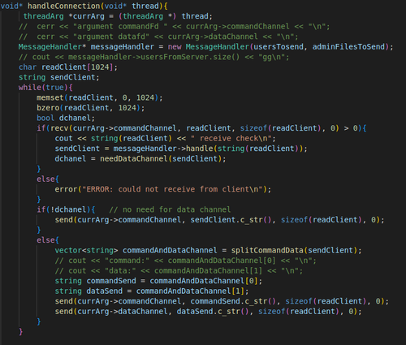

2) Client: The client side of the connection, which sends requests to the server and gets the proper response. Each client should login before entering other requests.


3) ConfigReader: Its duty is to read the json file given in command argument. Based on what it has read, it assigns admin files, users, command channel, and data channel. 

4) EvenLogger: Its function is to write down each request that is made by the clients, requests like downloading or uploading a file, logging in, logging out, etc.

5) MessageHandler: This sub-module gets each request from the server and fragments it into substrings (handle method). The substrings are then processed, and the type of request with its arguments are detected. Finally, the request's response is provided through handle functions (handleDownload, handleQuit, and so on) and sent back to the server.

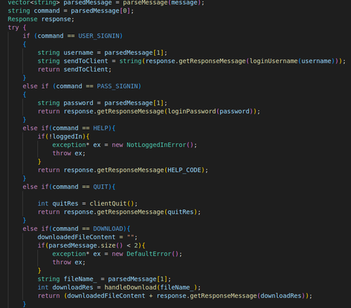

6) Response: A simple module which provides the feedback message to clients' commands. This message is sent to messageHandler, and based on the type of command, is appended to another main response or not. For example, in retr command, the message "Successful Download" is appended to the downloaded file content and sent to server. Server then splits the response and sends the content via data channel and the feedback via command channel.

7) User: A simple module which resembles the server's clients. Each client has a username, password, isAdmin, and MaxDownloadSize which are obtained through scanning the json input file.

How to run
### Go to server and client directories, and compile their respective MakeFiles
```make```

### Then in the server terminal, enter the following command:

``` ./Server.out config.json  ```

### Also enter this in the client side:

``` ./Client.out ```


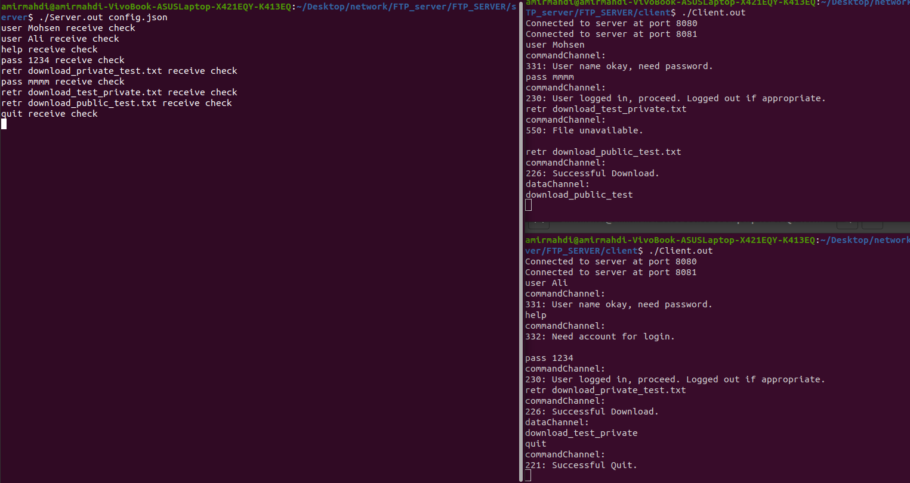

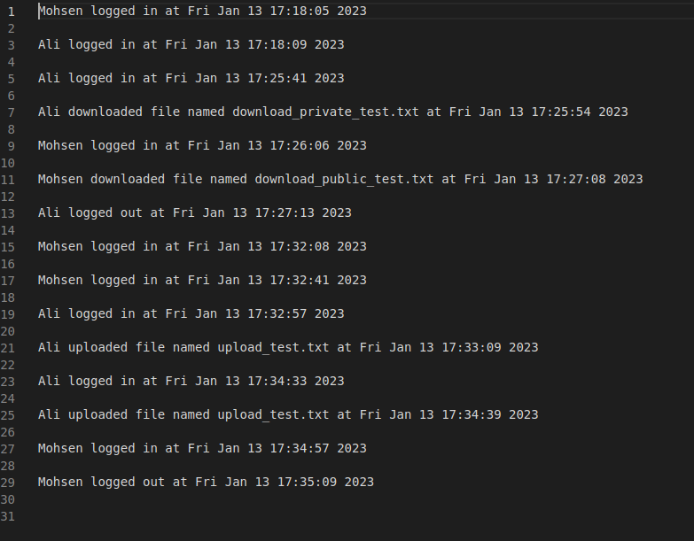


## 2: Web Server

A simple HTTP server with the ability to send 5-6 types of files.

How to run

For running you need a port. Any free port number works, so let's choose 4000 for our example.
### Compile and run in terminal
```make```

```./Server.out 127.0.0.1:4000```

### Open in browser
```Open localhost:4000/ in a browser```

The first page of the localhost lists all the available files in the server. You can view them by adding the file's name to the address bar.
You can also view the HTTP requests sent and received by the server in your terminal.

makefile and executing the file:

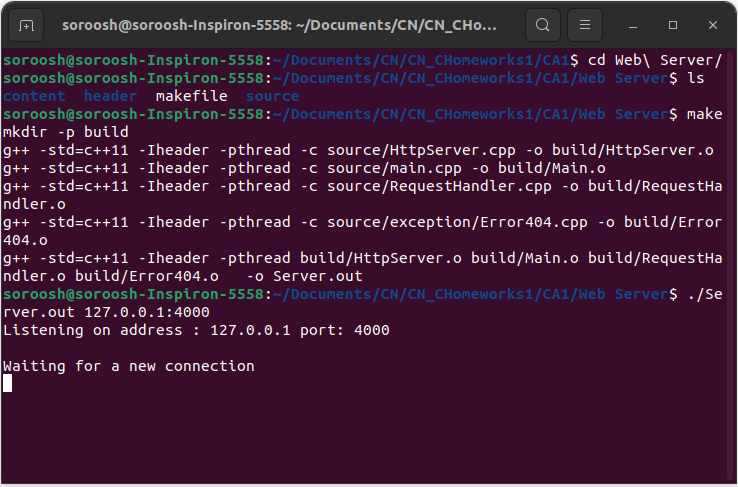
home page and the corresponding HTTP requests

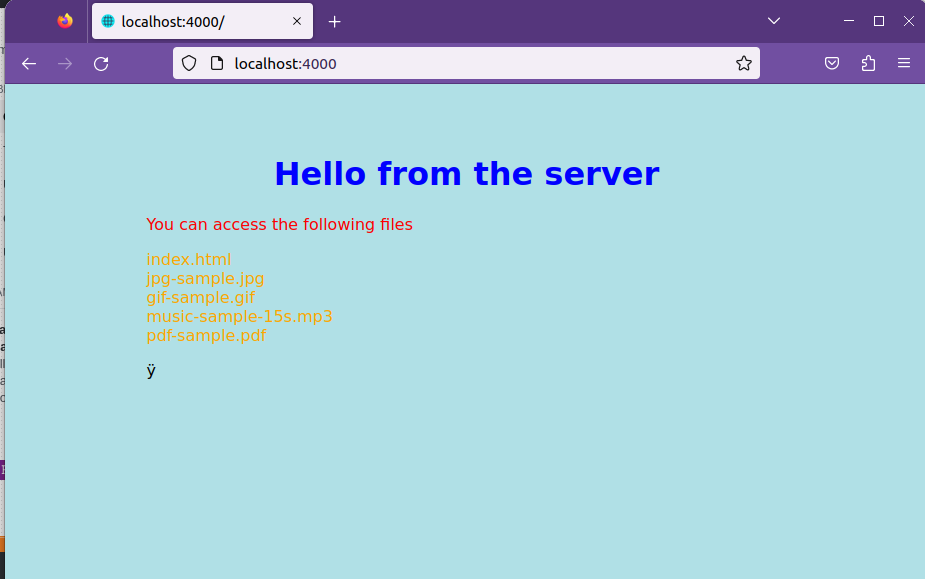

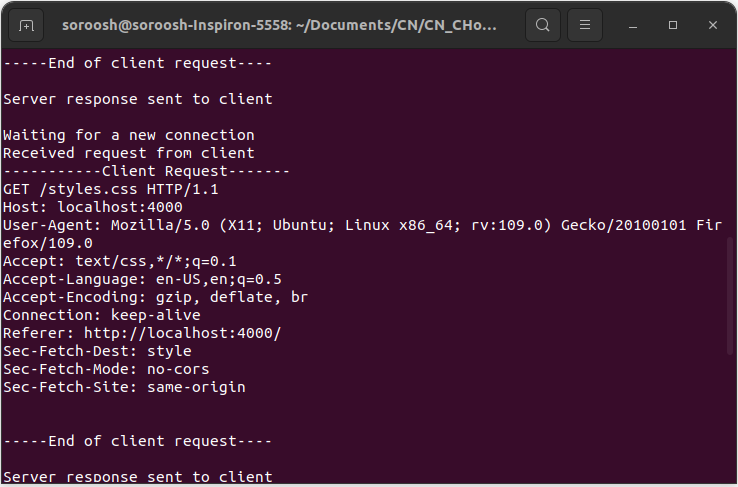

Opening an image file


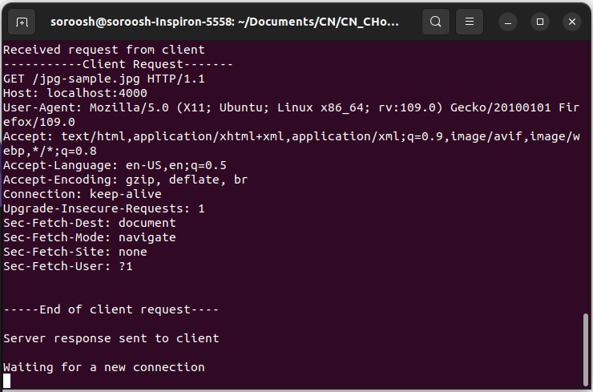


## 3: CHAT_ROOM


Multiple clients can chat with each other through connecting to a central server which keeps their names, ids, and archived messages. The most important modules are:

1) Client: Clients can send some commands to the server and get the results. The commands are: 
2) 
CONNECT: At the beginning of the connection, a packet containing this command is sent to server, and the server responds with CONNACK.

LIST: Through this command, the client can see other clients whom he can chat with. Its feedback is LISTREPLY.

SEND: A client can send a message to another person connected to the server via this command. Its feedback is SENDREPLY (stating wheter the message has been received by the server or not).

INFO: This command takes one argument, the id of a user. If that user is present, the response will be his name; otherwise, the payload will be empty.

RECEIVE: This command is used when a user wants to figure out wheter other users have sent him any messages or not. By sending this command, the user's archived messages from other people will be shown to him.

2) Server: The core module which receives messages from different clients and handles them. All the responses mentioned in the previous section are provided by this module.

3) MessageHandler: A submodule in the server which provides the server with the final string that should be sent to client.

4) User: A simulation of real clients in the server, each of which has a name, an id, and a channel.

HOW TO RUN:
Run the following commands for client and server in the respective terminals: 
```make```

```./Server.out <port>```

```make```

```./Client.out localhost:<port> <name>```

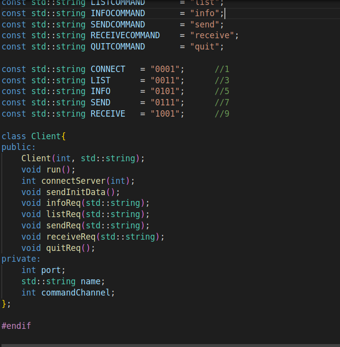
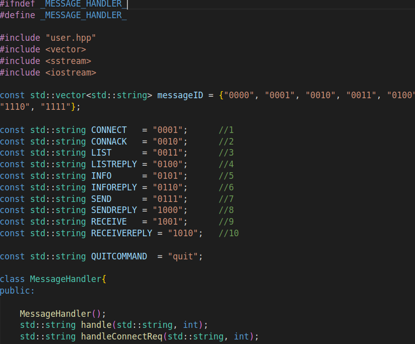

Here is a snapshot of the output:
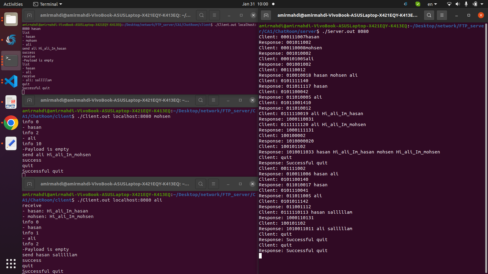


